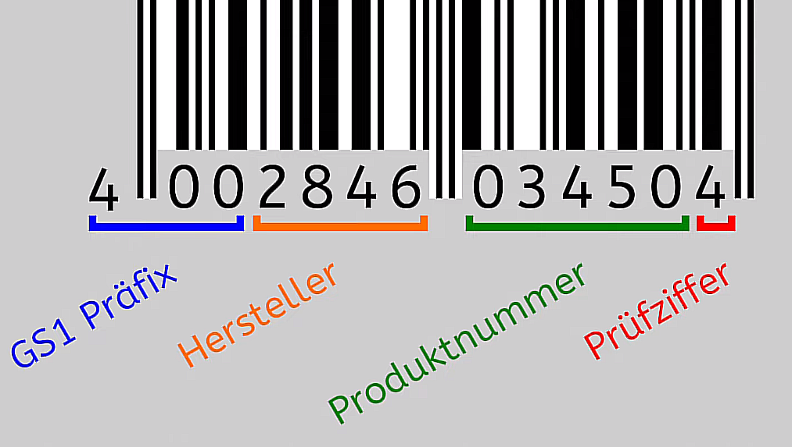

# Barcodes und QR-Codes

### [Link zur Aufgabe](https://www.inf-schule.de/information/darstellunginformation/barcode_qrcode)
#### [YouTube Tutorial](https://www.youtube.com/watch?v=GOYRT3-0IJI)

## Barcode-Prüfung
> Aufgabe 1

    (a) Der Code funktionirt nur wenn die Prüfziffer stimmt | (sum_gerade + (sum_ungerade * 3)) wird mit dem nächsten 10. subtrahiert

    (b) Man macht das um sicher zu stellen das der Bar-Code leser keinen Fehler gemacht hat

> Aufgabe 2

    